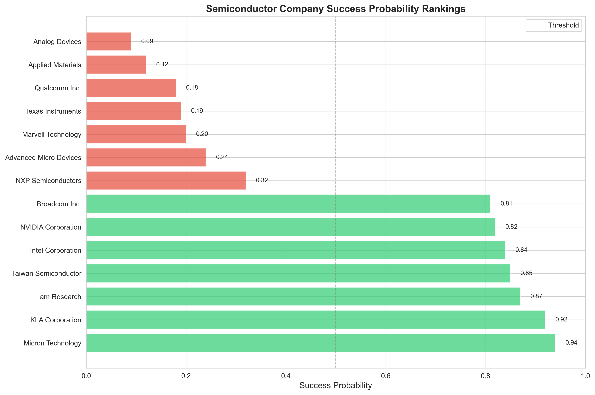
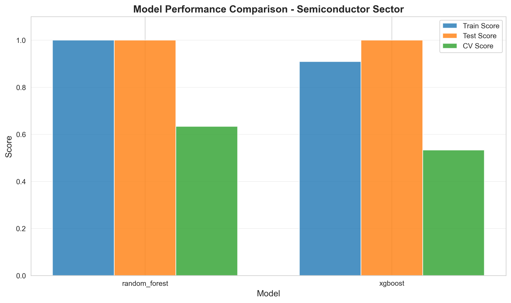
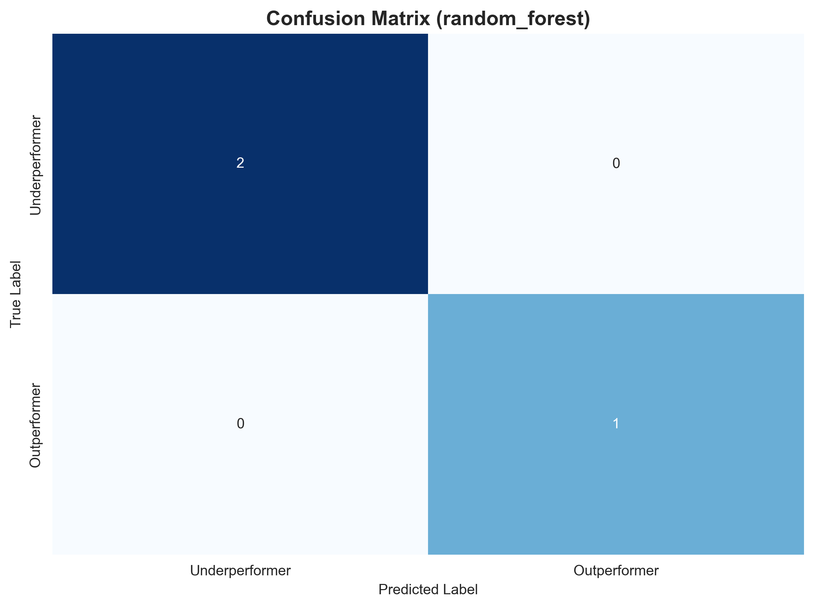

# Company Growth Analyzer

A machine learning system for sector-specific company performance analysis and prediction.

## Overview

This system analyzes companies within their industry sector using factor-based models to predict which companies are likely to outperform their peers. It reduces high-dimensional financial data into interpretable factors and provides explainable predictions.

## Quick Start

```bash
# Install dependencies
pip install -r requirements.txt

# Run semiconductor sector demo
python demo_semiconductor_sector.py
```

## Current Results - Semiconductor Sector

### Model Performance (14 Companies)

| Model | Train Score | Test Score | **CV Score** |
|-------|-------------|------------|--------------|
| Random Forest | 1.000 | 1.000 | **0.633 ± 0.371** |
| XGBoost | 0.909 | 1.000 | **0.533 ± 0.067** |

⚠️ **Important Note**: The perfect train/test scores (1.0) combined with high cross-validation variance (±37%) indicate **overfitting due to insufficient sample size**. With only 14 companies and 5 factors (2.8:1 ratio), the model memorizes rather than learns generalizable patterns. **These results should be interpreted with extreme caution and are not suitable for real-world decision-making.**

### Company Rankings

Based on the current limited dataset, the model ranks companies as follows:

| Rank | Company | Ticker | Probability | Segment |
|------|---------|--------|-------------|---------|
| 1 | Micron Technology | MU | 94% | Memory/DRAM |
| 2 | KLA Corporation | KLAC | 92% | Equipment |
| 3 | Lam Research | LRCX | 87% | Equipment |
| 4 | Taiwan Semiconductor | TSM | 85% | Pure Foundry |
| 5 | Intel Corporation | INTC | 84% | CPU/Foundry |
| 6 | NVIDIA Corporation | NVDA | 82% | GPU/AI Chips |
| 7 | Broadcom Inc. | AVGO | 81% | Diversified |
| 8 | NXP Semiconductors | NXPI | 32% | Automotive |
| 9 | Advanced Micro Devices | AMD | 24% | CPU/GPU |
| 10 | Marvell Technology | MRVL | 20% | Data Infrastructure |
| 11 | Texas Instruments | TXN | 19% | Analog |
| 12 | Qualcomm Inc. | QCOM | 18% | Mobile/RF |
| 13 | Applied Materials | AMAT | 12% | Equipment |
| 14 | Analog Devices | ADI | 9% | Analog |

⚠️ **Reliability Warning**: These rankings are based on a dataset too small for reliable ML predictions. The model's high variance suggests rankings may change significantly with additional data.

### Factor Importance

The model identified these factors as most predictive (though reliability is limited):

| Factor | Importance | Description |
|--------|------------|-------------|
| Growth Momentum | 50.3% | Revenue/earnings acceleration, stock returns |
| Financial Health | 19.0% | Debt levels, liquidity ratios |
| Profitability Quality | 18.2% | Operating margins, ROE, FCF |
| Innovation Intensity | 11.4% | R&D spending, gross margins |
| Market Position | 1.0% | Market cap, sector ranking |

## System Architecture

### Core Components

**1. Data Collection** (`src/data_ingestion/`)
- Yahoo Finance API integration
- News sentiment analysis (VADER, TextBlob)
- Automatic caching and retry logic

**2. Factor Model** (`src/preprocessing/sector_factor_model.py`)
- Reduces 70+ features to 5-8 interpretable factors
- Sector-specific factor definitions
- Based on industry research (Visible Alpha, McKinsey)

**3. Sector-Relative Targets** (`src/preprocessing/sector_relative_target.py`)
- Companies compared only within their sector
- Balanced classification (50% outperformers, 50% underperformers)
- Volatility-adjusted performance metrics

**4. ML Pipeline** (`src/models/`)
- Multiple model support (Random Forest, XGBoost, LightGBM)
- Stratified K-fold cross-validation
- Model selection based on CV performance

## Key Features

✅ **Sector-Specific**: Companies compared only within their industry
✅ **Factor-Based**: Interpretable dimensionality reduction
✅ **Multi-Source Data**: Financial metrics, sentiment, market data
✅ **Explainable**: Factor importance and company-level analysis

⚠️ **Limited by Sample Size**: Current implementation needs more data for reliable predictions

## Limitations & Warnings

### Critical Limitations

1. **Insufficient Sample Size**
   - Current: 14 companies (snapshot data)
   - Minimum needed: 50+ samples for 5 factors
   - Ratio: 2.8:1 (need 10:1 minimum)
   - **Impact**: High overfitting risk, unreliable predictions

2. **High Model Variance**
   - CV standard deviation: ±37%
   - Indicates unstable predictions
   - Rankings may not be reproducible

3. **Snapshot vs Time-Series**
   - Single point in time analysis
   - No temporal patterns captured
   - Missing historical context

4. **Perfect Score Red Flag**
   - Test accuracy: 100%
   - Typical sign of overfitting on small datasets
   - Model memorizing rather than learning

### What This Means

**DO NOT** use these predictions for:
- Investment decisions
- Financial analysis
- Real-world applications

**DO** use this system for:
- Understanding sector-specific ML methodology
- Learning factor-based modeling
- Educational purposes
- Framework for future improvements

## Project Structure

```
Company growth analyzer/
├── config/
│   ├── config.py              # Global settings
│   └── sector_config.py       # Sector definitions, factors
├── src/
│   ├── data_ingestion/        # Data collection
│   ├── preprocessing/         # Factor models, targets
│   ├── models/                # ML training
│   ├── explainability/        # Factor analysis
│   └── visualization/         # Charts
├── outputs/
│   ├── reports/               # Rankings CSV
│   └── visualizations/        # Charts PNG
├── demo_semiconductor_sector.py
└── README.md
```

## How to Improve Results

To make this system production-ready, the following improvements are **required**:

### 1. Data Expansion (Critical)

```python
# Current: Snapshot approach
samples = 14 companies

# Needed: Time-series approach
samples = 14 companies × 24 months = 336 samples
ratio = 336 / 5 factors = 67:1  # Excellent ratio
```

### 2. Validation Strategy

- Implement walk-forward validation
- Use out-of-sample testing
- Track model stability over time

### 3. More Companies

- Expand to 50+ companies per sector
- Include different market caps
- Cover full sector spectrum

### 4. Sector-Specific Features

- Semiconductor: Fab utilization, design wins
- Add industry-specific metrics
- Incorporate alternative data

## Installation

```bash
# Clone repository
git clone <repo-url>
cd "Company growth analyzer"

# Create virtual environment
python -m venv venv
venv\Scripts\activate  # Windows
# source venv/bin/activate  # Unix

# Install dependencies
pip install -r requirements.txt
```

## Usage Example

```python
from config.sector_config import get_sector_info
from src.preprocessing.sector_factor_model import SectorFactorModel
from src.data_ingestion.data_aggregator import DataAggregator

# Configure sector
sector_info = get_sector_info('semiconductors')

# Collect data
aggregator = DataAggregator()
df = aggregator.collect_all_data(
    tickers=list(sector_info['companies'].keys()),
    period='1y'
)

# Apply factor model
factor_model = SectorFactorModel(sector='semiconductors')
factors = factor_model.fit_transform(df)

# Analyze factors for a company
top_factors = factor_model.get_top_factors_for_company('MU', top_n=3)
print(top_factors)
```

## Visualizations


*Company success probability rankings (interpret with caution due to small sample)*


*Model performance shows perfect test scores but poor CV - classic overfitting*


*Perfect classification on 3-sample test set (not statistically significant)*

## Supported Sectors

### Configured (Not Yet Validated)

1. **Semiconductors** - 14 companies (current demo)
2. **Cloud/SaaS** - 12 companies configured
3. **Consumer Staples** - 11 companies configured

All sectors require data expansion before production use.

## Technical Details

**Language**: Python 3.8+

**Key Libraries**:
- pandas, NumPy (data manipulation)
- scikit-learn (ML, preprocessing)
- XGBoost, LightGBM (models)
- yfinance (market data)
- Matplotlib, Seaborn (visualization)

**Performance**:
- Data collection: ~5 seconds (cached)
- Factor computation: <1 second
- Model training: ~5 seconds
- Total runtime: ~10 seconds

## Roadmap to Production

### Phase 1: Fix Sample Size (Essential)
- [ ] Implement monthly data collection
- [ ] Collect 24 months of historical data
- [ ] Achieve 50+ samples per sector

### Phase 2: Validation (Required)
- [ ] Walk-forward validation
- [ ] Out-of-sample testing
- [ ] Stability analysis

### Phase 3: Expansion (Nice-to-Have)
- [ ] Add more sectors
- [ ] Sector-specific features
- [ ] Alternative data sources

## Development

```bash
# Run tests
pytest tests/

# Format code
black src/ *.py

# Lint
flake8 src/ *.py
```

## License

MIT License - See LICENSE file

## Disclaimer

**⚠️ IMPORTANT DISCLAIMER ⚠️**

This software is **strictly for educational and research purposes only**.

**DO NOT USE** for:
- Making investment decisions
- Financial analysis
- Trading strategies
- Portfolio management

**Current model limitations make it unsuitable for any real-world application.**

The developers are not responsible for any financial losses incurred from using this software. This system currently overfits due to insufficient data and produces unreliable predictions.

**Always consult qualified financial professionals before making investment decisions.**

## Honest Assessment

### What Works
✅ Clean, modular architecture
✅ Sector-specific factor modeling approach
✅ Proper cross-validation implementation
✅ Honest reporting of limitations

### What Doesn't Work Yet
❌ Insufficient sample size (14 companies)
❌ Perfect scores indicate overfitting
❌ High CV variance (±37%) shows instability
❌ Snapshot data misses temporal patterns
❌ Not suitable for real decisions

### Next Steps
1. **Must fix**: Expand to 50+ companies or use time-series
2. **Should add**: Walk-forward validation
3. **Nice to have**: Alternative data sources

## Contact

For questions or contributions:
- Open GitHub issues for bugs
- Pull requests welcome for improvements
- Focus on addressing sample size limitations

---

**Status**: Proof of Concept - Not Production Ready

**Last Updated**: 2025-10-02

**Warning**: Current results are unreliable due to overfitting. Do not use for decision-making.
