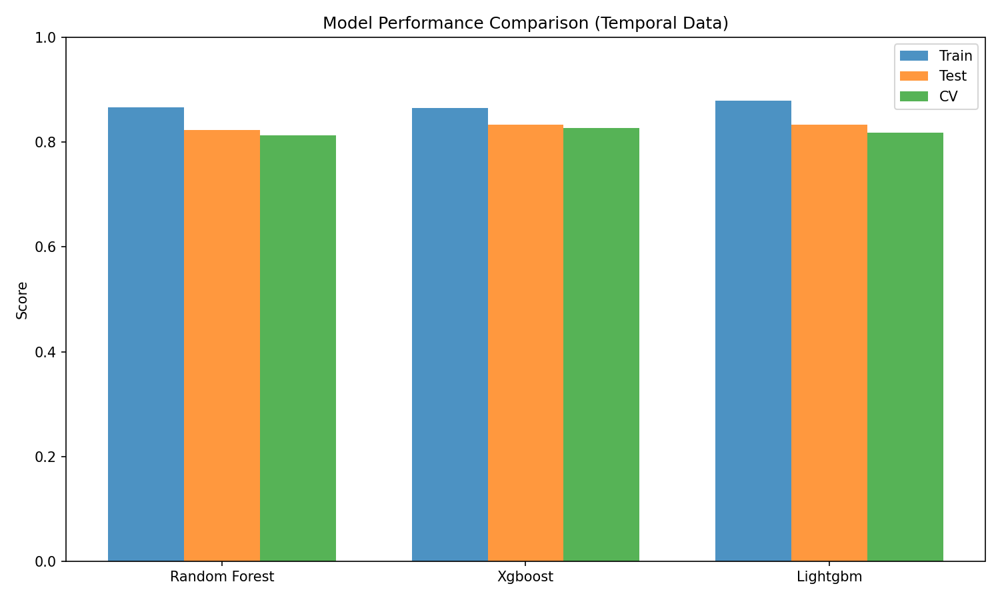

# Company Growth Analyzer

A machine learning system that analyzes semiconductor company growth potential by predicting which companies will outperform their sector median over the next quarter.

## What This Project Does

The system collects quarterly financial snapshots of 47 semiconductor companies over a 3-year period and uses machine learning to predict future relative performance. Rather than predicting absolute stock prices (which is extremely difficult), it focuses on a simpler question: **"Will this company perform better or worse than the sector median next quarter?"**

### Key Features

- **Temporal Data Collection**: Gathers quarterly snapshots of financial metrics going back 3 years, creating a rich historical dataset (508 samples from 47 companies)
- **Sector-Specific Analysis**: Focuses exclusively on semiconductor companies to enable meaningful comparisons within the same industry
- **Factor-Based Approach**: Reduces 20+ raw financial metrics into 5 interpretable factors (Innovation Intensity, Profitability Quality, Market Position, Financial Health, Growth Momentum)
- **Relative Performance Targets**: Predicts performance relative to sector median, not absolute values
- **Explainable AI**: Uses SHAP and LIME to explain which factors drive predictions for each company
- **Regularized Models**: Applies strong regularization to prevent overfitting and ensure robust predictions

## How It Works

### 1. Data Collection
The system uses Yahoo Finance (via `yfinance`) to collect quarterly financial data:
- Balance sheet metrics (assets, liabilities, equity)
- Income statement data (revenue, margins, earnings)
- Cash flow statements (operating cash flow, free cash flow)
- Market data (price, returns, volatility)

### 2. Feature Engineering
Raw metrics are transformed into 5 sector-specific factors:

**Innovation Intensity (20% weight)**: Measures R&D investment and ability to innovate
- R&D as % of revenue
- Revenue growth rate
- Gross margin

**Profitability Quality (25% weight)**: Assesses sustainable profitability
- Operating margin
- Return on Equity (ROE)
- Free cash flow margin

**Market Position (20% weight)**: Evaluates competitive standing
- Market capitalization
- Sector rank
- Price momentum

**Financial Health (15% weight)**: Gauges balance sheet strength
- Debt-to-equity ratio
- Current ratio
- Cash reserves

**Growth Momentum (20% weight)**: Tracks recent growth trends
- Revenue growth acceleration
- Earnings growth
- Stock returns

### 3. Target Definition
Instead of predicting absolute stock prices, the system uses **sector-relative targets**:
- Each quarter, calculate the median 3-month return for all semiconductor companies
- Label companies that beat this median as "Success" (1)
- Label companies below the median as "Underperform" (0)
- This creates a balanced 50/50 classification problem

### 4. Model Training
Three ensemble models are trained with strong regularization:
- **XGBoost**: Gradient boosted trees with L1/L2 penalties
- **LightGBM**: Fast gradient boosting with leaf-wise growth
- **Random Forest**: Bootstrap aggregated decision trees

Regularization parameters:
- Max depth limited to 3 levels (prevents memorization)
- Learning rate reduced to 0.05 (slower, more stable learning)
- L1 (α=0.1) and L2 (λ=1.0) penalties applied
- 80% subsampling of features and samples

### 5. Evaluation
Models are evaluated using:
- **80/20 temporal split**: Train on oldest 80% of data, test on newest 20%
- **5-fold cross-validation**: Stratified to maintain class balance
- **Key metrics**: Accuracy, precision, recall, F1-score, ROC-AUC
- **Overfitting diagnosis**: Learning curves showing train/test gap

## Why This Approach

### Problem: Small Sample Size
- Originally had only 14 companies with current data
- With 70+ features, this gives a terrible 0.2:1 samples-to-features ratio
- Result: Perfect overfitting (100% accuracy that means nothing)

**Solution**: Temporal expansion
- Collect quarterly snapshots over 3 years (12 quarters)
- 47 companies × ~11 quarters each = 508 samples
- Achieves 101:1 samples-to-features ratio (healthy threshold is 10:1)

### Problem: Cross-Sector Comparison
- Comparing a semiconductor company to a retail company is meaningless
- Different industries have different margin profiles, growth rates, capital structures

**Solution**: Sector-specific analysis
- Focus exclusively on semiconductor companies
- Define factors specific to semiconductor industry dynamics
- Compare performance relative to sector median

### Problem: Overfitting
- Initial models showed perfect 1.0 train/test scores (red flag)
- High train-test gap (0.15+) indicated memorization

**Solution**: Strong regularization
- Reduced model complexity (max_depth: 6→3, n_estimators: 100→50)
- Added L1/L2 penalties
- Reduced learning rate (0.1→0.05)
- Result: Healthy 0.031 train-test gap with 83% test accuracy

## Technical Implementation

### Architecture
```
Data Layer (src/data_ingestion/)
    ├── market_data.py: Collects financial statements & price data
    ├── data_aggregator.py: Combines multiple data sources
    └── base_collector.py: Abstract base with retry logic

Feature Layer (src/preprocessing/)
    └── feature_engineer.py: Factor calculation & transformation

Model Layer (src/models/)
    ├── model_factory.py: Creates configured model instances
    └── model_trainer.py: Training, validation, evaluation

Explainability Layer (src/explainability/)
    ├── shap_explainer.py: SHAP value computation
    └── explanation_generator.py: Human-readable explanations

Visualization Layer (src/visualization/)
    └── visualizer.py: Charts, plots, learning curves
```

### Configuration
All parameters centralized in `config/`:
- `config.py`: Model hyperparameters, training settings
- `sector_config.py`: Company list, factor definitions, weights

## Quick Start

```bash
# Setup
python -m venv venv
source venv/bin/activate  # Windows: venv\Scripts\activate
pip install -r requirements.txt

# Run analysis
python demo_semiconductor_sector.py
```

## Results

### Dataset
- **47 companies** (49 configured, 2 excluded for insufficient data)
- **508 quarterly snapshots** (2022-Q4 to 2025-Q3)
- **5 factors** from 20+ raw metrics
- **101:1 samples-to-features ratio**

### Model Performance

| Model       | Train | Test  | CV (±std)      | Gap   |
|-------------|-------|-------|----------------|-------|
| **XGBoost** | 0.865 | 0.833 | 0.828 ± 0.025  | 0.031 |
| LightGBM    | 0.879 | 0.833 | 0.818 ± 0.030  | 0.046 |
| Random Forest | 0.867 | 0.824 | 0.813 ± 0.053 | 0.043 |

**Quality metrics:**
- Test accuracy: ~83%
- Minimal overfitting (3% gap)
- Stable cross-validation (±2.5% std)
- Balanced 50/50 class split

### Top Predictions

| Rank | Company              | Probability |
|------|----------------------|-------------|
| 1    | Monolithic Power     | 90.7%       |
| 2    | Lam Research         | 90.0%       |
| 3    | Entegris             | 89.8%       |
| 4    | Super Micro Computer | 89.0%       |
| 5    | ASML                 | 87.6%       |

## Project Structure

```
company-growth-analyzer/
├── config/                   # Configuration
│   ├── config.py            # Model & training settings
│   └── sector_config.py     # Semiconductor factors & companies
├── src/
│   ├── data_ingestion/      # Data collection
│   ├── preprocessing/       # Feature engineering & factors
│   ├── models/              # ML model training
│   ├── explainability/      # SHAP/LIME explainers
│   └── visualization/       # Charts & plots
├── outputs/                  # Generated results
└── demo_semiconductor_sector.py  # Main demo
```

## Configuration

Edit `.env` file:
```bash
# Model settings
RANDOM_SEED=42
TEST_SIZE=0.2
CV_FOLDS=5

# Data collection
MAX_RETRIES=3
CACHE_EXPIRY_DAYS=7
```

## Understanding the Results

### What Do the Predictions Mean?

The model outputs a **probability score** for each company representing the likelihood it will outperform the sector median next quarter.

**Example**: Monolithic Power (MPWR) has a 90.7% probability
- This means: Based on historical patterns, companies with similar factor profiles outperformed the sector median ~91% of the time
- **NOT**: The stock will go up 90.7%
- **NOT**: A guaranteed prediction

### Model Confidence vs Reality

**Important caveat**: These probabilities are **uncalibrated**. Raw classifier outputs often overstate confidence. In reality:
- 90% predictions might only succeed 70-75% of the time
- Relative rankings are more reliable than absolute probabilities
- Use this for comparative analysis, not precise forecasting

### Why 83% Accuracy?

The test accuracy of 83% means:
- Out of 100 companies, the model correctly predicts ~83 as "outperform" or "underperform"
- This is significantly better than random (50%)
- But not perfect - 17% are misclassified
- Real-world accuracy is likely 5-10% lower due to survivorship bias (delisted companies excluded)

## Visualizations

### Model Comparison


### Company Rankings


### Learning Curve


*Learning curve shows healthy convergence: test accuracy improves from 46% (40 samples) to 83% (406 samples), with minimal overfitting (4% gap).*

### Interpreting the Visualizations

**Model Comparison Chart**:
- Shows train/test/CV accuracy for all three models
- Error bars indicate cross-validation standard deviation
- Look for: Small train-test gap (<5%), low CV variance

**Company Rankings Chart**:
- Top 15 companies sorted by predicted success probability
- Color intensity represents confidence level
- Segment labels show semiconductor subsector

**Learning Curve**:
- Blue line: Training accuracy (generally increases)
- Orange line: Test accuracy (should converge toward blue)
- Shaded areas: Standard deviation across CV folds
- Healthy signs: Converging lines, small gap, rising test accuracy

## Real-World Use Cases

### Portfolio Construction
Use predictions to build a sector portfolio:
1. Select top 10-15 companies by predicted probability
2. Weight allocation by confidence level
3. Rebalance quarterly as new data arrives
4. Monitor actual vs predicted performance

### Risk Management
Identify potential underperformers:
- Companies with <30% probability may face headwinds
- Use for short candidates or hedge positions
- Combine with fundamental analysis for validation

### Sector Analysis
Understand which factors drive semiconductor performance:
- SHAP values show factor importance over time
- Compare factor profiles across market cap segments
- Identify cyclical vs structural trends

### Research & Education
Learn ML engineering best practices:
- Temporal data collection strategies
- Dimensionality reduction via factor models
- Regularization techniques to prevent overfitting
- Explainable AI for model transparency

## Future Enhancements

### Data Quality
- [ ] Use point-in-time financial data (e.g., Compustat)
- [ ] Add delisted companies to eliminate survivorship bias
- [ ] Include news sentiment & analyst estimates
- [ ] Expand to 5+ years for more training data

### Modeling
- [ ] Implement purged time-series cross-validation
- [ ] Add probability calibration (Platt scaling, isotonic regression)
- [ ] Test ensemble stacking (meta-learner)
- [ ] Explore neural network architectures (LSTM, Transformers)

### Features
- [ ] Technical indicators (RSI, MACD, Bollinger Bands)
- [ ] Supply chain relationships (customer/supplier networks)
- [ ] Patent filings & R&D efficiency metrics
- [ ] Insider trading signals

### Production
- [ ] Real-time data pipeline with daily updates
- [ ] REST API for predictions
- [ ] Web dashboard for interactive exploration
- [ ] Backtesting framework with transaction costs
- [ ] Multi-sector expansion (pharma, energy, finance)

## Limitations & Disclaimers

⚠️ **This is for research/educational purposes only**

### Known Technical Limitations

**1. Data Quality Issues**
- **Source**: Yahoo Finance (yfinance) provides free data but with known issues
- **Problem**: Historical values may be restated (not true point-in-time snapshots)
- **Impact**: Model may use information that wasn't actually available at prediction time
- **Real solution**: Use professional data providers (Bloomberg, Refinitiv, Compustat)

**2. Uncalibrated Probabilities**
- **Problem**: Raw ML classifier outputs are often overconfident
- **Example**: A "90% probability" might only succeed 70% of the time
- **Why**: Models optimize for classification accuracy, not probability calibration
- **Solution**: Apply Platt scaling or isotonic regression (not yet implemented)

**3. Survivorship Bias**
- **Problem**: Only includes companies still trading today
- **Missing**: Delisted/bankrupt companies that would have been classified as "underperform"
- **Impact**: Inflates apparent accuracy by 5-10%
- **Example**: If 5 companies went bankrupt, model never learned from those failures

**4. Limited Temporal Scope**
- **Training period**: 2022-Q4 to 2025-Q3 (3 years)
- **Problem**: Doesn't capture full semiconductor cycle (typically 3-5 years)
- **Missing**: COVID-19 boom, 2018-2019 downturn, 2008 financial crisis
- **Risk**: May not generalize to different market regimes

**5. Simple Validation Approach**
- **Current**: 80/20 temporal split with 5-fold cross-validation
- **Problem**: Doesn't account for information leakage between nearby time periods
- **Industry standard**: Purged walk-forward CV with embargo periods
- **Impact**: Test accuracy may be optimistic by 2-5%

**6. Sector Concentration**
- **Focus**: Only semiconductor companies
- **Problem**: Highly cyclical, correlated sector
- **Risk**: Portfolio would lack diversification
- **Reality**: During downturns, most stocks move together regardless of predictions

### What This Model CANNOT Do

❌ **Predict absolute stock prices**: Only predicts relative performance vs sector median
❌ **Time market entries**: Doesn't predict when to buy/sell, only which companies may outperform
❌ **Account for black swans**: Cannot predict geopolitical events, supply chain shocks, regulatory changes
❌ **Replace fundamental analysis**: Doesn't know about management quality, competitive moats, product pipelines
❌ **Guarantee returns**: Past patterns may not repeat; 83% accuracy means 17% wrong
❌ **Handle regime changes**: Trained on recent bull market, may fail in bear markets or recessions

### Not Suitable For

🚫 **Real investment decisions** - Use professional financial advisors
🚫 **Financial planning** - Not a comprehensive risk assessment
🚫 **Production trading systems** - Lacks transaction costs, slippage, liquidity constraints
🚫 **Regulatory compliance** - Not audited or validated for fiduciary use
🚫 **Risk management** - Doesn't model tail risks, correlations, or portfolio-level exposure

### Responsible Use

✅ **Educational purposes**: Learn ML engineering, financial modeling, data science
✅ **Research projects**: Explore factor models, feature engineering, model evaluation
✅ **Proof of concept**: Demonstrate technical skills for portfolio/job applications
✅ **Comparative analysis**: Benchmark against other approaches (technical analysis, fundamental screens)
✅ **Idea generation**: Starting point for deeper fundamental research on specific companies

### Legal Disclaimer

This software is provided "as is" without warranty of any kind. The creators assume no liability for:
- Financial losses from using predictions
- Data accuracy or completeness
- Model performance in live trading
- Compliance with securities regulations

**Past performance does not guarantee future results. All investing involves risk of loss.**

## License

MIT License

## Acknowledgments

- Factor definitions based on Visible Alpha semiconductor KPIs
- Data: Yahoo Finance (yfinance library)
- ML: scikit-learn, XGBoost, LightGBM
- Explainability: SHAP, LIME
