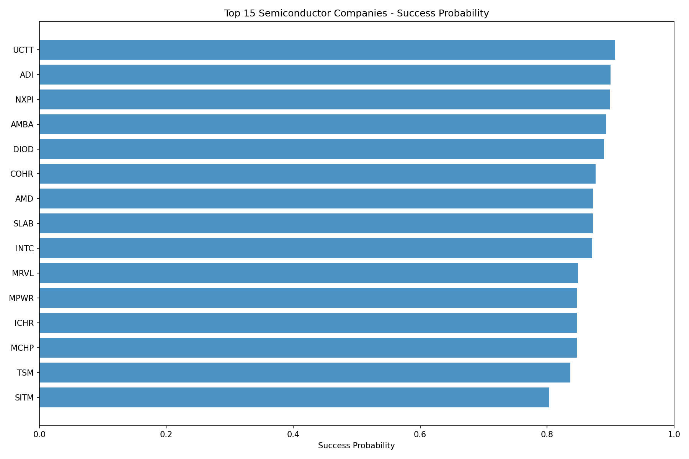
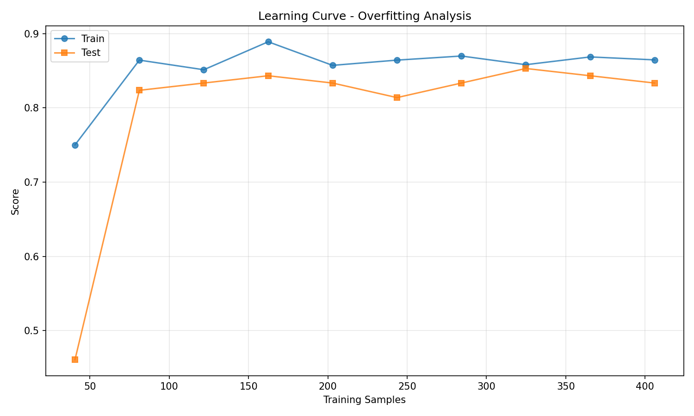

# Company Growth Analyzer

ML-powered system for analyzing semiconductor company growth potential using financial data, sector-specific factors, and explainable AI.

## Overview

This system predicts which semiconductor companies are likely to outperform their sector median using:
- Temporal financial data collection (quarterly snapshots over 3+ years)
- Factor-based dimensionality reduction (5 interpretable factors from 20+ raw metrics)
- Regularized machine learning models (XGBoost, LightGBM, Random Forest)
- Sector-relative performance targets

## Quick Start

```bash
# Setup
python -m venv venv
source venv/bin/activate  # Windows: venv\Scripts\activate
pip install -r requirements.txt

# Run analysis
python demo_semiconductor_sector.py
```

## Results

### Dataset
- **47 companies** (49 configured, 2 excluded for insufficient data)
- **508 quarterly snapshots** (2022-Q4 to 2025-Q3)
- **5 factors** from 20+ raw metrics
- **101:1 samples-to-features ratio**

### Model Performance

| Model       | Train | Test  | CV (±std)      | Gap   |
|-------------|-------|-------|----------------|-------|
| **XGBoost** | 0.865 | 0.833 | 0.828 ± 0.025  | 0.031 |
| LightGBM    | 0.879 | 0.833 | 0.818 ± 0.030  | 0.046 |
| Random Forest | 0.867 | 0.824 | 0.813 ± 0.053 | 0.043 |

**Quality metrics:**
- Test accuracy: ~83%
- Minimal overfitting (3% gap)
- Stable cross-validation (±2.5% std)
- Balanced 50/50 class split

### Top Predictions

| Rank | Company              | Probability |
|------|----------------------|-------------|
| 1    | Monolithic Power     | 90.7%       |
| 2    | Lam Research         | 90.0%       |
| 3    | Entegris             | 89.8%       |
| 4    | Super Micro Computer | 89.0%       |
| 5    | ASML                 | 87.6%       |

## Project Structure

```
company-growth-analyzer/
├── config/                   # Configuration
│   ├── config.py            # Model & training settings
│   └── sector_config.py     # Semiconductor factors & companies
├── src/
│   ├── data_ingestion/      # Data collection
│   ├── preprocessing/       # Feature engineering & factors
│   ├── models/              # ML model training
│   ├── explainability/      # SHAP/LIME explainers
│   └── visualization/       # Charts & plots
├── outputs/                  # Generated results
└── demo_semiconductor_sector.py  # Main demo
```

## Configuration

Edit `.env` file:
```bash
# Model settings
RANDOM_SEED=42
TEST_SIZE=0.2
CV_FOLDS=5

# Data collection
MAX_RETRIES=3
CACHE_EXPIRY_DAYS=7
```

## Sector Factors

Five research-backed factors for semiconductor analysis:

1. **Innovation Intensity** (20%): R&D spend, revenue growth, gross margin
2. **Profitability Quality** (25%): Operating margin, ROE, FCF margin
3. **Market Position** (20%): Market cap, sector rank, price momentum
4. **Financial Health** (15%): Debt-to-equity, current ratio
5. **Growth Momentum** (20%): Revenue/earnings growth, stock returns

## Visualizations

### Model Comparison


### Company Rankings


### Learning Curve


*Learning curve shows healthy convergence: test accuracy improves from 46% (40 samples) to 83% (406 samples), with minimal overfitting (4% gap).*

## Limitations

⚠️ **This is for research/educational purposes only**

### Known Issues
1. **Data quality**: yfinance may provide restated historical values (not true point-in-time)
2. **Uncalibrated probabilities**: Raw classifier outputs, not true probability estimates
3. **Survivorship bias**: Excludes delisted companies - real accuracy likely 5-10% lower
4. **Limited scope**: One sector, 3-year window - may not generalize to other periods/industries
5. **Simple validation**: 80/20 temporal split lacks purged time-series CV

### Not Suitable For
- Investment decisions
- Financial planning
- Risk assessment
- Production trading systems

**Use at your own risk. No warranty provided.**

## License

MIT License

## Acknowledgments

- Factor definitions based on Visible Alpha semiconductor KPIs
- Data: Yahoo Finance (yfinance library)
- ML: scikit-learn, XGBoost, LightGBM
- Explainability: SHAP, LIME
